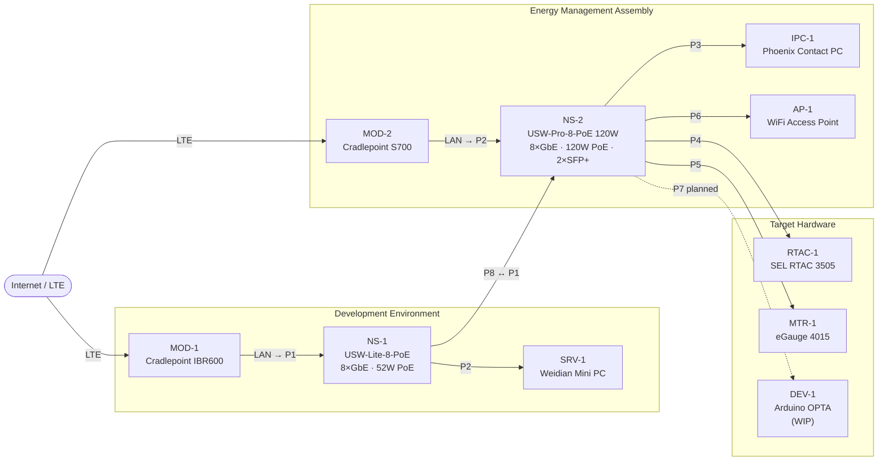

# Home Networking and Controls Development Lab

Documentation and observability repository for an industrial automation and energy management development lab.

## Lab Diagram

> Click any device node to open its documentation. Port labels show switch port assignments.



## Device Registry

| Tag | Device | Type | Segment |
|-----|--------|------|---------|
| [MOD-1](docs/devices/cradlepoint-ibr600.md) | Cradlepoint IBR600 | LTE Router | Development |
| [SRV-1](docs/devices/weidian-mini-pc.md) | Weidian Mini PC | Linux Server | Development |
| [NS-1](docs/devices/ubiquiti-usw-lite-8-poe.md) | Ubiquiti USW-Lite-8-PoE | Managed Switch | Development |
| [MOD-2](docs/devices/cradlepoint-s700.md) | Cradlepoint S700 | 5G/LTE Router | EMA Assembly |
| [NS-2](docs/devices/ubiquiti-usw-pro-8-poe.md) | Ubiquiti USW-Pro-8-PoE 120W | Managed Switch | EMA Assembly |
| [IPC-1](docs/devices/phoenix-contact-pc.md) | Phoenix Contact PC | Industrial PC | EMA Assembly |
| [AP-1](docs/devices/wifi-ap.md) | WiFi Access Point | Wireless AP | EMA Assembly |
| [RTAC-1](docs/devices/sel-rtac-3505.md) | SEL RTAC 3505 | Automation Controller | Target Hardware |
| [MTR-1](docs/devices/egauge-4015.md) | eGauge 4015 | Power Meter | Target Hardware |
| [DEV-1](docs/devices/arduino-opta.md) | Arduino OPTA | Industrial PLC / Test Device | Target Hardware |

## Repository Structure

```
docs/
  network.json       — NetJSON source of truth for all device/network config
  architecture.md    — Network architecture and segment details
  devices/           — Per-device documentation (generated sections synced from network.json)
observability/
  logging.md         — Log collection strategy
  monitoring.md      — Monitoring setup
scripts/
  sync-device-docs.py  — Propagates network.json changes to device markdown files
  collect-logs.sh      — Log collection automation
```

> To update device network config: edit `docs/network.json`, then run `python3 scripts/sync-device-docs.py`.
