# Home Networking and Controls Development Lab

Documentation and observability repository for an industrial automation and energy management development lab.

## Lab Diagram

> Click any device node to open its documentation. Port labels show switch port assignments.

```mermaid
graph LR
    WAN(["Internet / LTE"])

    subgraph DEV["Development Environment"]
        MOD1["MOD-1\nCradlepoint IBR600"]
        NS1["NS-1\nUSW-Lite-8-PoE\n8×GbE · 52W PoE"]
        PC1["PC-1\nFanless PC"]
    end

    subgraph EMA["Energy Management Assembly"]
        MOD2["MOD-2\nCradlepoint S700"]
        NS2["NS-2\nUSW-Pro-8-PoE 120W\n8×GbE · 120W PoE · 2×SFP+"]
        PC2["PC-2\nPhoenix Contact PC"]
        AP2["AP-2\nWiFi Access Point"]
    end

    subgraph TGT["Target Hardware"]
        RTAC1["RTAC-1\nSEL RTAC 3505"]
        MET1["MET-1\neGauge 4015"]
        DEV1["DEV-1\nArduino OPTA\n(WIP)"]
    end

    WAN -->|LTE| MOD1
    WAN -->|LTE| MOD2
    MOD1 -->|"LAN → P1"| NS1
    NS1 -->|"P2"| PC1
    NS1 -->|"P8 ↔ P1"| NS2
    MOD2 -->|"LAN → P2"| NS2
    NS2 -->|"P3"| PC2
    NS2 -->|"P4"| RTAC1
    NS2 -->|"P5"| MET1
    NS2 -->|"P6"| AP2
    NS2 -.->|"P7 planned"| DEV1

    click MOD1 "docs/devices/mod-1.md"
    click MOD2 "docs/devices/mod-2.md"
    click NS1 "docs/devices/ns-1.md"
    click NS2 "docs/devices/ns-2.md"
    click PC1 "docs/devices/pc-1.md"
    click PC2 "docs/devices/pc-2.md"
    click AP2 "docs/devices/ap-2.md"
    click RTAC1 "docs/devices/rtac-1.md"
    click MET1 "docs/devices/met-1.md"
    click DEV1 "docs/devices/dev-1.md"
```



## Device Registry

<!-- NETJSON:REGISTRY:START -->
| Tag | Device | Type | Segment | MAC Address | Serial Number |
|-----|--------|------|---------|-------------|---------------|
| [MOD-1](docs/devices/mod-1.md) | Cradlepoint IBR600 | LTE Cellular Router | Development | 00:30:44:70:3F:C5 | IMEI: 865 4930 4342 5942 |
| [MOD-2](docs/devices/mod-2.md) | Cradlepoint S700 | 5G/LTE Branch Router | EMA Assembly | TBD | TBD |
| [NS-1](docs/devices/ns-1.md) | Ubiquiti USW-Lite-8-PoE | Managed Layer 2 PoE Switch | Development | 0C:EA:14:7F:BC:92 | TBD |
| [NS-2](docs/devices/ns-2.md) | Ubiquiti USW-Pro-8-PoE 120W | Managed Layer 2/3 PoE Switch | EMA Assembly | TBD | TBD |
| [PC-1](docs/devices/pc-1.md) | Fanless PC | Industrial Fanless Mini PC | Development | 8c:03:60:4c:d5:fa | TBD |
| [PC-2](docs/devices/pc-2.md) | Phoenix Contact PC | Industrial DIN-Rail PC | EMA Assembly | TBD | TBD |
| [AP-2](docs/devices/ap-2.md) | WiFi Access Point | Wireless Access Point | EMA Assembly | TBD | TBD |
| [RTAC-1](docs/devices/rtac-1.md) | SEL RTAC 3505 | Real-Time Automation Controller | Target Hardware | TBD | TBD |
| [MET-1](docs/devices/met-1.md) | eGauge 4015 | Revenue-Grade Power Meter | Target Hardware | TBD | TBD |
| [DEV-1](docs/devices/dev-1.md) | Arduino OPTA | Industrial Programmable Logic Controller | Target Hardware | TBD | TBD |
<!-- NETJSON:REGISTRY:END -->

## Repository Structure

```
docs/
  network.json       — NetJSON source of truth for all device/network config
  architecture.md    — Network architecture and segment details
  devices/           — Per-device documentation (generated sections synced from network.json)
observability/
  logging.md         — Log collection strategy
  monitoring.md      — Monitoring setup
scripts/
  sync-device-docs.py  — Propagates network.json changes to device markdown files
  collect-logs.sh      — Log collection automation
```

---

## Editing This Repository

### Edit manually
| File / Section | What belongs here |
|----------------|-------------------|
| `docs/network.json` | IPs, MACs, serial numbers, hostnames, port assignments, link topology |
| `docs/architecture.md` | All content — narrative architecture, topology diagram, protocol overview |
| Device doc **narrative sections** | Role description, Key Specs, Physical Connections, Protocol Map, Management Access, Notes |
| `observability/` | Logging and monitoring strategy docs |

### Do NOT edit manually (code-driven)
These sections are **overwritten** every time `sync-device-docs.py` runs:

| What | Marker |
|------|--------|
| Device doc H1 title | First `# ` line — format: `# TAG — Label` |
| Device info table | `NETJSON:START` … `NETJSON:END` HTML comments |
| Interface/port table | `NETJSON:INTERFACES:START` … `NETJSON:INTERFACES:END` HTML comments |
| README device registry | `NETJSON:REGISTRY:START` … `NETJSON:REGISTRY:END` HTML comments |

### Workflow for updating network config

```bash
# 1. Edit the source of truth
$EDITOR docs/network.json

# 2. Propagate to all device docs
python3 scripts/sync-device-docs.py

# 3. Check for inconsistencies (stale tags, missing markers, broken links)
python3 scripts/sync-device-docs.py --validate

# 4. Commit everything together
git add docs/network.json docs/devices/ && git commit
```
