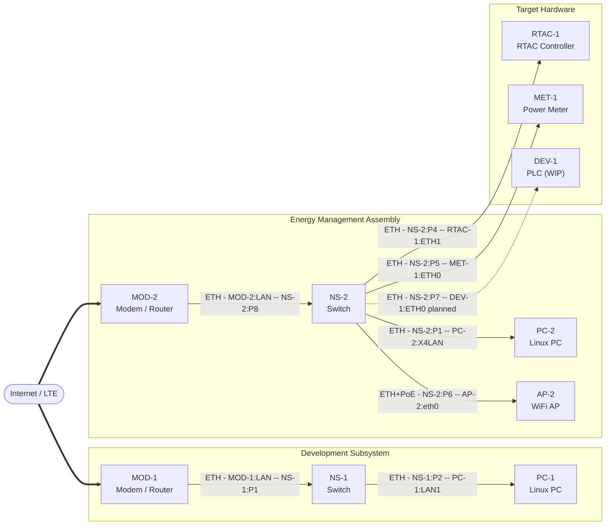

# Home Networking and Controls Development Lab

Documentation and observability repository for an industrial automation and energy management development lab.

## Lab Diagram

> Port labels show switch port assignments. Use the Device Registry table below to navigate to device docs.



**Connection Types**

| Line Style | Medium | Port Labels | Notes |
|------------|--------|-------------|-------|
| `A --> B` solid arrow | Ethernet | Yes — `SRC:port -- DST:port` | Physical copper cable |
| `A ==> B` thick arrow | Cellular / LTE / 5G | No | Wireless WAN — no physical cable |
| `A -.-> B` dotted arrow | WiFi | No | Wireless LAN *(reserved — not yet used)* |
| `A --o B` circle-end | RS-485 / Serial | Yes | Physical serial cable *(reserved — not yet used)* |
| `A -.-> B` dotted arrow with label | Planned / inactive | Yes | Link defined, not yet physically connected |

See [docs/architecture.md](docs/architecture.md) for the full connection type standard.

## Device Registry

<!-- NETJSON:REGISTRY:START -->

**Development Subsystem**

| Tag | Device | Type | MAC Address | Serial Number |
|-----|--------|------|-------------|---------------|
| [MOD-1](docs/devices/mod-1.md) | Cradlepoint IBR600 | LTE Cellular Router | 00:30:44:70:3F:C5 | IMEI: 865 4930 4342 5942 |
| [NS-1](docs/devices/ns-1.md) | Ubiquiti USW-Lite-8-PoE | Managed Layer 2 PoE Switch | 0C:EA:14:7F:BC:92 | TBD |
| [PC-1](docs/devices/pc-1.md) | Fanless PC | Industrial Fanless Mini PC | 8c:03:60:4c:d5:fa | TBD |

**Energy Management Assembly**

| Tag | Device | Type | MAC Address | Serial Number |
|-----|--------|------|-------------|---------------|
| [AP-2](docs/devices/ap-2.md) | WiFi Access Point | Wireless Access Point | TBD | TBD |
| [MOD-2](docs/devices/mod-2.md) | Cradlepoint S700 | 5G/LTE Branch Router | TBD | TBD |
| [NS-2](docs/devices/ns-2.md) | Ubiquiti USW-Pro-8-PoE 120W | Managed Layer 2/3 PoE Switch | TBD | TBD |
| [PC-2](docs/devices/pc-2.md) | Phoenix Contact PC | Industrial DIN-Rail PC | TBD | TBD |

**Target Hardware**

| Tag | Device | Type | MAC Address | Serial Number |
|-----|--------|------|-------------|---------------|
| [DEV-1](docs/devices/dev-1.md) | Arduino OPTA | Industrial Programmable Logic Controller | TBD | TBD |
| [MET-1](docs/devices/met-1.md) | eGauge 4015 | Revenue-Grade Power Meter | TBD | TBD |
| [RTAC-1](docs/devices/rtac-1.md) | SEL RTAC 3505 | Real-Time Automation Controller | TBD | TBD |

<!-- NETJSON:REGISTRY:END -->

## Repository Structure

```
docs/
  network.json       — NetJSON source of truth for all device/network config
  architecture.md    — Network architecture and segment details
  devices/           — Per-device documentation (generated sections synced from network.json)
observability/
  logging.md         — Log collection strategy
  monitoring.md      — Monitoring setup
scripts/
  sync-device-docs.py  — Propagates network.json changes to device markdown files
  collect-logs.sh      — Log collection automation
```

---

## Editing This Repository

### Edit manually
| File / Section | What belongs here |
|----------------|-------------------|
| `docs/network.json` | IPs, MACs, serial numbers, hostnames, port assignments, link topology |
| `docs/architecture.md` | All content — narrative architecture, topology diagram, protocol overview |
| Device doc **narrative sections** | Role description, Key Specs, Physical Connections, Protocol Map, Management Access, Notes |
| `observability/` | Logging and monitoring strategy docs |

### Do NOT edit manually (code-driven)
These sections are **overwritten** every time `sync-device-docs.py` runs:

| What | Marker |
|------|--------|
| Device doc H1 title | First `# ` line — format: `# TAG — Label` |
| Device info table | `NETJSON:START` … `NETJSON:END` HTML comments |
| Interface/port table | `NETJSON:INTERFACES:START` … `NETJSON:INTERFACES:END` HTML comments |
| README device registry | `NETJSON:REGISTRY:START` … `NETJSON:REGISTRY:END` HTML comments |

### Workflow for updating network config

```bash
# 1. Edit the source of truth
$EDITOR docs/network.json

# 2. Propagate to all device docs
python3 scripts/sync-device-docs.py

# 3. Check for inconsistencies (stale tags, missing markers, broken links)
python3 scripts/sync-device-docs.py --validate

# 4. Commit everything together
git add docs/network.json docs/devices/ && git commit
```
